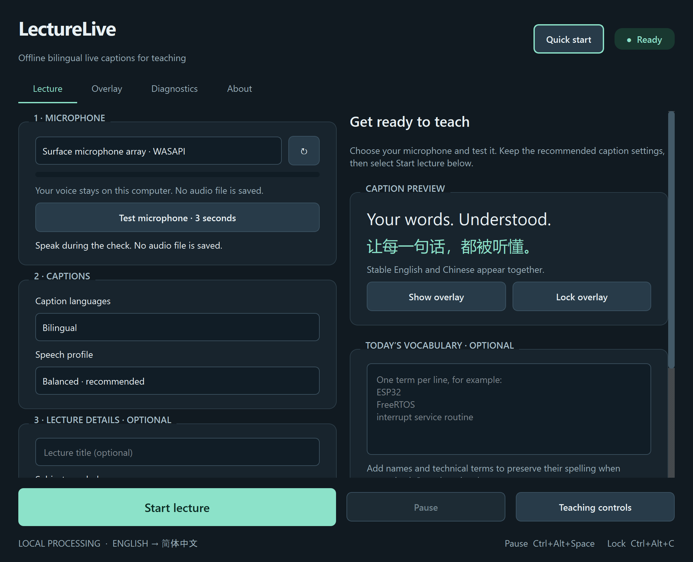

# LectureLive

**Speak in English. Show English and Simplified Chinese captions.**

LectureLive adds a floating caption panel to your Windows desktop or projector while you teach.
Speech recognition and translation run on your computer. Once setup is complete, everyday use
needs no internet connection, account or API key. Microphone audio is not recorded; saving text
transcripts is optional.



> **Preview release:** translations can make mistakes. Try it with your actual microphone and
> projector before teaching. [Current testing and limitations](STATUS.md).

## Before you begin

You need:

- **Windows 11.** The established ARM64 edition is tested on a Snapdragon X Elite Surface.
  **Windows 11 Intel/AMD x64 PCs can now try the beta.** See the [Windows beta guide](docs/WINDOWS_BETA.md)
  for GPU acceleration and experimental Intel/AMD NPU preparation. Macs and Linux are not supported.
- **A microphone** — use the one you intend to teach with.
- **Internet for the first setup** and at least **15 GB of free disk space** recommended.
  Keep the computer plugged in while setup downloads the models and builds the app.
- A projector or second screen only if you want to show captions there.

**Not sure which PC you have?** Open Windows **Settings → System → About**. Look for an
**System type**: an ARM-based Snapdragon PC uses ARM64; an x64-based Intel/AMD PC uses the beta.
Setup chooses the edition automatically. You do **not** need to
install Python, Git, CUDA or any developer tools yourself.

## Install from GitHub — no terminal commands needed

1. Open [the Polyglot repository](https://github.com/DionCroft/Polyglot).
2. Select the green **Code** button, then **Download ZIP**.
3. Find the ZIP in Downloads. Right-click it and select **Extract All…**.
4. Put the extracted folder somewhere you want to keep it, for example
   `C:\Users\YourName\Documents\LectureLive`. Open the folder containing **Setup.cmd** and this README.
   **Do not run setup inside the ZIP.**
5. Double-click **Setup.cmd**. If Windows hides file extensions, it may appear as **Setup**,
   with the type **Windows Command Script**.
6. Keep the setup window open. It shows three stages: checking your computer, preparing the app,
   and creating a launcher. The first run downloads several GB and may take several minutes or
   longer on a slow connection. Wait for **SETUP COMPLETE**.
7. Press a key to close the setup window. Double-click **Launch.cmd**, or find **LectureLive**
   in the Windows Start menu.

Setup installs its own private Python runtime and verified model files inside this folder.
It does not replace your system Python or add itself to Windows startup. Keep the folder in place;
the Start menu shortcut points to it.

**If Windows or your university blocks scripts or unsigned apps:** follow your organisation’s
software approval process. This build is unsigned. You do not need to disable antivirus or
change permanent PowerShell settings. If you cannot run it, share the message with your IT team.

**Interrupted download?** Open the same folder and run **Setup.cmd** again. Verified files are
reused and supported downloads resume. If setup stops, read the message and the **setup.log**
file in that folder. See the troubleshooting table below.

## Already received a ready-to-run copy?

If someone gives you the complete **LectureLive** application folder, extract/copy the whole
folder and open **LectureLive.exe** inside it. Keep the adjacent **_internal** folder — it
contains files the app needs. No setup or initial model download is needed for that complete copy.
For a beta copy, open **LectureLive-x64-Beta.exe** inside the complete **LectureLive-x64-Beta** folder.
The GitHub **Download ZIP** described above is source code and needs **Setup.cmd** first.

## Your first captions

1. Open LectureLive and wait for **Ready**.
2. Choose your microphone, select **Test microphone · 3 seconds**, and speak. Check that the meter moves.
3. Leave **Bilingual** selected. Use **Balanced** on ARM64 or **Fast** and **Automatic** processing
   on the x64 beta. Lecture details and presets are optional.
4. Select **Start lecture** at the bottom. Speak a sentence and pause briefly. Captions appear in a floating panel.
5. Select **Pause** for a break, **Resume** to continue, and **Stop lecture** when finished.
   Wait for the last caption to finish saving.

For a projector, use **Overlay → caption display → Preview captions on selected display** before
starting. **Teaching controls** opens a small floating panel for use alongside your slides.
The **Quick start** button opens help inside the app, even offline.

Default shortcuts: **Ctrl + Alt + Space** pauses/resumes; **Ctrl + Alt + C** locks/unlocks the
caption panel. Change them under **Overlay**.

## Help with common problems

| What you see | What to do |
|---|---|
| Intel/AMD PC | Use the current Setup.cmd, or Setup-Beta.cmd. Read the [beta guide](docs/WINDOWS_BETA.md). |
| Setup stops during a download | Check your connection and free disk space, then run Setup.cmd again in the same folder. Keep setup.log if you need help. |
| “Close LectureLive…” during setup | Finish your lecture and close the app, then run setup again. |
| No microphone or no moving meter | Connect/select the microphone, use the refresh button, then test again. Check Windows microphone permissions if access is denied. |
| English appears but Chinese does not | Check that Bilingual is selected. Read any warning; close the app and rerun Setup.cmd if translation files are missing. |
| Captions are slow | Try Fast for the next session, close heavy applications, and pause briefly between sentences. |
| Captions are on the wrong display | Open Overlay and select your projector or preferred caption display. |
| Double-clicking Launch says the app is not ready | Run Setup.cmd and wait for SETUP COMPLETE. |
| You want your saved text | Open Diagnostics → Open transcripts. |

For more detail: [Quick start](docs/QUICK_START.md) · [User guide](docs/USER_GUIDE.md) ·
[Installation and repair](docs/INSTALLATION.md) · [Offline recovery](docs/OFFLINE_SETUP.md).

## Updates and removal

To update from GitHub, download and extract the new source ZIP into a new folder and run its
**Setup.cmd**. Keep your previous working copy until the new one works. The Start menu shortcut
will point to the newly installed copy. Settings and transcripts stay in
`%LOCALAPPDATA%\LectureLive` (ARM64) or `%LOCALAPPDATA%\LectureLive Beta` (x64); back up important transcripts before updating.

To remove the app, close it and delete the extracted application/project folder and its Start menu
shortcut. This leaves your settings and transcripts intact. Only remove
`%LOCALAPPDATA%\LectureLive` separately if you also want to delete that personal data.

## Project contact

**Dr Dion Miroy Mariyanayagam BEng (Hons) PGCert FHEA PhD MIET CEng**

Senior Lecturer of Electronic and Embedded Systems

Course Leader for:

- BEng (Hons) Computer Systems Engineering and Robotics
- BEng (Hons) Electronics Engineering and IoT
- MSc Robotics with AI

School of Computing and Digital Media

Department of Communications Technology and Mathematics

London Metropolitan University

**Email:** [d.mariyanayagam@londonmet.ac.uk](mailto:d.mariyanayagam@londonmet.ac.uk)

These details are also available under **About** in the application.

## For developers

The repository contains source, glossaries, pinned setup manifests, documentation and synthetic/public
test evidence. Large models, runtimes, executables, recordings and private transcripts are excluded from Git.
Use the private ARM64 runtime created by setup (replace `runtime` with `runtime-x64` for beta development):

```powershell
.\runtime\python.exe -m pytest -q
powershell -NoProfile -ExecutionPolicy Bypass -File .\scripts\setup.ps1 -VerifyOnly
```

[Architecture](docs/ARCHITECTURE.md) · [Model licences](docs/MODEL_LICENSES.md) ·
[Translation evaluation](docs/TRANSLATION_EVALUATION.md) · [Acceptance checklist](docs/ACCEPTANCE_TESTS.md).
