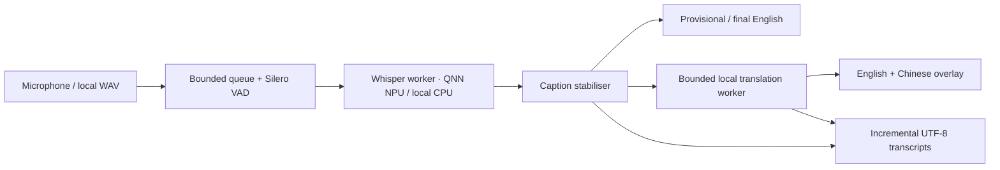

# LectureLive

**Offline bilingual live captions for teaching**

LectureLive is a local English-to-Simplified-Chinese live captioning application for
Windows on ARM. It is designed to run completely offline once its speech and
translation models have been installed.

**Development build — read [STATUS.md](STATUS.md) before teaching.** Real Snapdragon
NPU speech, native CPU recovery, microphone capture, local translation and the desktop
pipeline have been exercised. Physical Airplane Mode, projector and unplug/reconnect
acceptance still need sign-off. Translation quality needs lecturer review.

## Repository contents

This repository contains source, glossaries, pinned setup manifests, build scripts,
documentation and synthetic/public test evidence. Model weights, runtimes, binaries,
recovery archives, recordings and private transcripts remain outside Git.

For first setup on Windows ARM64, run:

```powershell
powershell -NoProfile -ExecutionPolicy Bypass -File .\scripts\setup.ps1 -Build
```

Setup downloads and verifies pinned assets while online; ordinary app use remains
fully local. See [installation](docs/INSTALLATION.md) and [offline recovery](docs/OFFLINE_SETUP.md).

## Version 0.2 improvements

- Finish captured speech and translations on Stop; isolate saving failures and recover journals.
- Keep bilingual pairs visible until replacements arrive; stabilise provisional prefixes.
- Save lecture presets, check microphone levels, preview the projector and use compact controls.
- Configure global shortcuts and retry interrupted input; retry NPU failures on local CPU.
- Reuse verified models and repair assets through pinned, resumable setup.
- Expanded translation, noise, failure, workflow and long-session checks; see
  [the improvement goal](docs/IMPROVEMENT_PLAN.md) and [translation evaluation](docs/TRANSLATION_EVALUATION.md).

## Launch

Open `dist/LectureLive/LectureLive.exe`. Keep the entire adjacent `_internal` folder.
No terminal, login, API key, model download, CUDA, WSL or Docker is used at launch.
Choose the microphone and glossary, then **Start lecture**. Under **Overlay**, select
the projector. **Ctrl+Alt+C** locks/unlocks; **Ctrl+Alt+Space** pauses/resumes.

- Balanced: Whisper Small FP16 on the Qualcomm NPU (default).
- Fast: Whisper Base FP16 on the NPU.
- Local CPU recovery: separate Whisper Base int8 ONNX models.
- Accuracy: explicitly unavailable; no unbenchmarked model is advertised as ready.
- Translation: local Marian/OPUS-MT, four-beam decoding, Mandarin Simplified prefix
  and OpenCC Simplified Chinese normalization.



See [User guide](docs/USER_GUIDE.md), [Installation](docs/INSTALLATION.md),
[Offline recovery](docs/OFFLINE_SETUP.md), [Architecture](docs/ARCHITECTURE.md),
[Performance](docs/PERFORMANCE.md), [Licenses](docs/MODEL_LICENSES.md), and
[Acceptance tests](docs/ACCEPTANCE_TESTS.md).

## Development

Use the project-local **native ARM64** `runtime/python.exe`; the machine's original
`python` command is AMD64. Run `runtime/python.exe -m pytest -q` and
`runtime/python.exe scripts/test_pipeline.py`. `scripts/build.ps1` creates the native
Windows bundle. Setup-only download scripts are never imported by the app.
