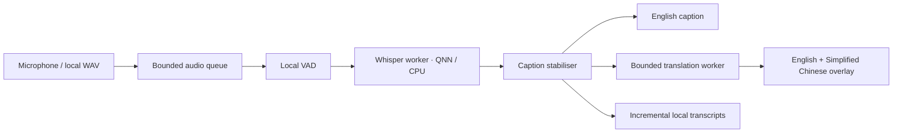

# Architecture and decisions

LectureLive targets the verified Snapdragon X1E80100 with native CPython 3.11.9 ARM64.
UI: PySide6 6.11.2. Inference: ONNX Runtime 1.29.0 with QNN plugin 2.5.0.
The plugin is registered through register_execution_provider_library and
add_provider_for_devices; old examples assuming a monolithic QNN wheel are obsolete.

Whisper: Qualcomm precompiled Whisper Base, release 0.61.0, exact X Elite variant.
QNN sessions disable CPU fallback so NPU proof cannot accidentally measure CPU.
A distinct standard ONNX Whisper graph is required for CPU recovery; an EPContext
binary cannot execute on CPU. Balanced Small and Accuracy stay unavailable until tested.

Translation: onnx-community/opus-mt-en-zh, quantized encoder, first decoder and cached
decoder, SentencePiece + local vocab; no Transformers or hosted model loader.
Whisper log-mel features use NumPy and the downloaded official mel filter bank.
Python audit hook blocks networking at runtime; this does not prove native DLL silence.
OS-level network and Airplane Mode tests remain mandatory.

Sources verified 2026-09-08:
- https://onnxruntime.ai/docs/execution-providers/QNN-ExecutionProvider.html
- https://github.com/onnxruntime/onnxruntime-qnn
- https://pypi.org/pypi/onnxruntime-qnn/json (2.5.0 ARM64 cp311 wheel observed)
- https://pypi.org/pypi/onnxruntime/json (1.29.0 ARM64 cp311 wheel observed)
- https://download.qt.io/official_releases/QtForPython/pyside6/
- https://github.com/qualcomm/ai-hub-apps/tree/apps/v0.36.0/whisper_windows_py
- https://huggingface.co/qualcomm/Whisper-Base (release_assets manifest archived)
- https://huggingface.co/onnx-community/opus-mt-en-zh

The public Qualcomm page has contradictory Compute support text. Exact downloadable
chipset artifacts and actual strict-provider inference determine support here.

## Verified implementation refinements

Surface WASAPI input requires shared-mode sample-rate conversion (48 kHz hardware to
16 kHz pipeline). Fixed 512-sample VAD frames feed a 128-frame queue. Phrase queue and
translation queue capacities are four. Completed captions remain on screen while the
next phrase is provisional. A session epoch invalidates stale display events on pause.

All regular launches run local encoder, VAD and translation inference checks on a
background thread. Speech/model inference never runs on the Qt event thread.
OPUS uses the required `>>cmn_Hans<<` prefix, four-beam cached decoding, and local
OpenCC normalization. A tested M2M100 alternative was slower and had its own technical
errors, so it is excluded from the default bundle.

Append-only English export precedes translation. A bounded pending-pair map preserves
subtitle order if a later translation is skipped before an earlier one finishes.
ONNX telemetry is explicitly disabled. Python socket creation, DNS and send operations
are denied. OS-level native traffic verification remains an acceptance requirement.
