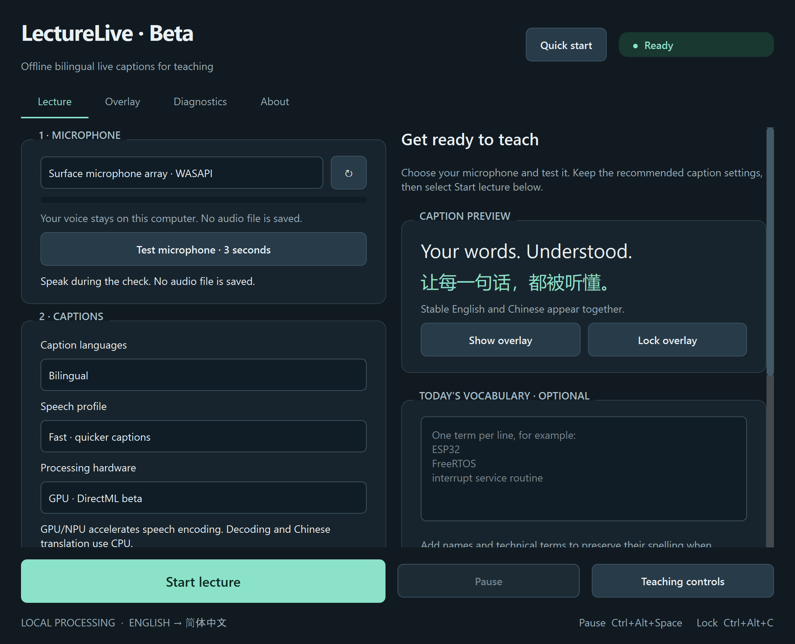

# Windows x64 beta verification — 2026-09-09

Builds: x64 **0.4.0b1**, ARM64 **0.3.1**. Machine: Snapdragon X Elite Surface,
Windows 11 ARM64. The x64 executable used Windows emulation. GPU work actually ran
through DirectML on Adreno. No physical Intel/AMD machine was available.

| Check | Result |
|---|---|
| pytest on x64 | 55 passed |
| pytest on ARM64 | 55 passed |
| Critical syntax/name checks | Ruff E9/F63/F7/F82 passed |
| x64 offline assets | 119 dependency files and 21 model files verified; pip check passed |
| Full x64 setup | Offline install/build completed with no shortcut requested |
| Executable headers | x64 0x8664; ARM64 0xAA64 |
| Packaged beta | CPU and GPU speech, Chinese translation and VAD passed |
| Packaged ARM64 | Fast/Balanced Qualcomm NPU, CPU speech, Chinese translation and VAD passed |
| Native beta window | Five hardware choices, Fast-only profile, synthetic lecture/Stop and controls passed |
| Worker crash | Terminated our own GPU worker; the same public speech phrase was retried successfully on CPU |
| Intel/AMD NPU absent | Both selections reported unavailable and continued on CPU; neither claimed NPU execution |
| Provider preparation | Windows ML catalog reported no Intel/AMD NPU on this machine |

The live microphone was not used for these beta tests. Audio fixtures were a public JFK
recording and an existing synthetic electronics sentence. Full model downloads were not
repeated during the final installer check; the independently pinned x64 wheels and encoder
were downloaded and verified earlier in the same implementation session.

- [Packaged x64 report](packaged-x64-beta-0.4.json)
- [Packaged ARM64 report](packaged-arm64-0.3.1.json)
- [CPU/GPU/NPU-selection report](backends-x64-beta-0.4.json)
- [Worker-crash recovery report](worker-crash-x64-beta-0.4.json)
- [Native UI report](ui-x64-beta-0.4.json)



## Remaining hardware acceptance

Physical Intel/AMD CPU and GPU tests, Intel/AMD NPU model acceptance, vendor-driver crash/hang
behavior, sustained lecture sessions, native-library network audits and classroom microphone/
projector tests remain open. The beta supports trying the provider integrations; it does not
certify NPU compatibility or claim all Intel/AMD hardware has been tested. Single-fixture timings
are observations on this Surface, not comparative benchmarks for other machines.

## Reproduce locally

After Setup-Beta.cmd, open PowerShell in the extracted source folder:

```powershell
.\runtime-x64\python.exe -m pytest -q
.\runtime-x64\python.exe scripts\verify_beta.py
.\runtime-x64\python.exe scripts\verify_beta_ui.py
```

The integration scripts need the fixture WAV files (obtained through the pinned fixture manifest).
The UI script expects a working DirectML GPU and uses isolated test preferences. Missing hardware
should be reported as missing, not silently counted as a successful acceleration test.
