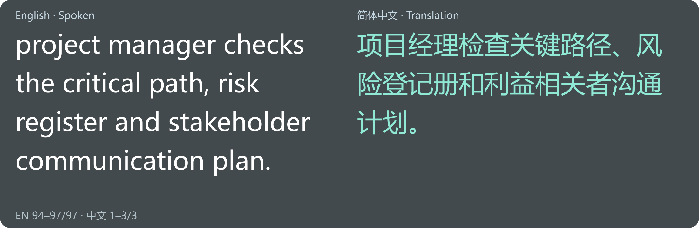
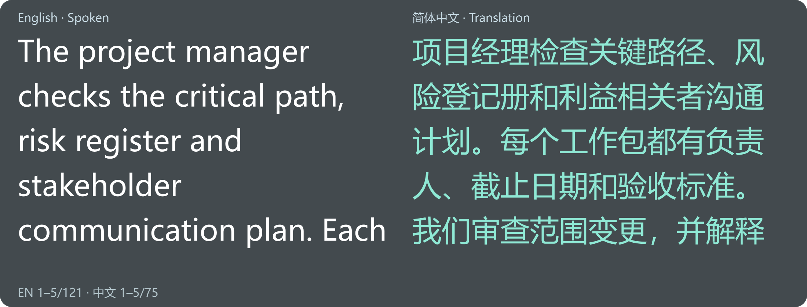
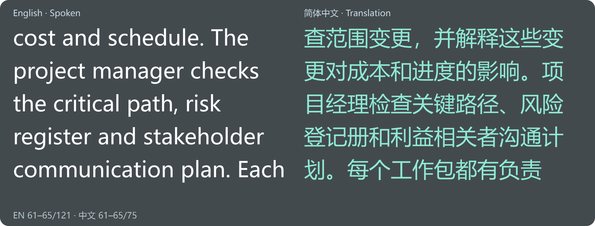
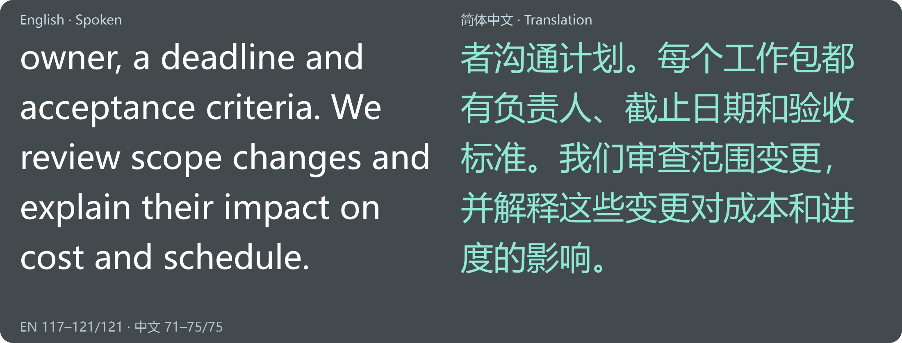
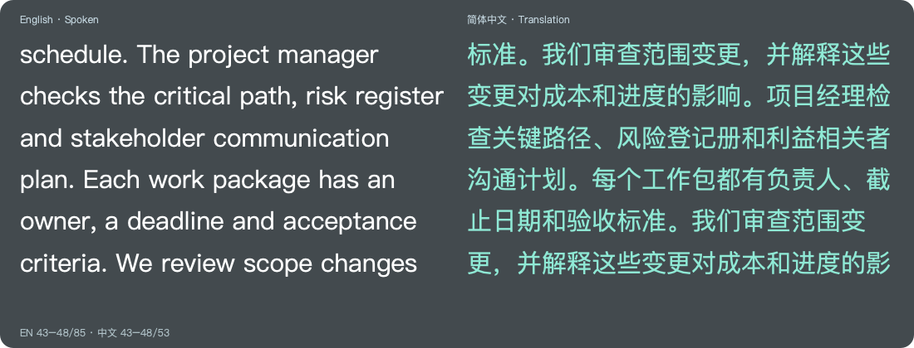

# Complete paragraph playback — 27 September 2026

Application commit: `86ed6b3` (0.8.1b1). No speech/translation model, decoding,
CO7000 vocabulary, language-detection threshold or export-format changes.

## Defect reproduced before the fix

The previous projector removed older table rows to fit the panel, then immediately
scrolled to the bottom of an oversized paragraph. Both languages shared that offset.
This could hide the paragraph's beginning and the entire shorter translation.

Reproduced with the **native Windows renderer**, using the old overlay from `3383d4c`
without modifying the working application. At 1100 × 360, 30-point text, a 2,304-character
English passage and 27-character Chinese translation produced a 6,024-pixel document.
The display started at pixel 5,746; the Chinese column was blank. The same text, font
and panel size now reach full visible-line coverage, and the Chinese translation stays
visible throughout. See `long-before-native.json` and `long-matched-native.json`.

## Implementation

- Committed passages enter an ordered queue. New arrivals do not replace unread text.
- Each language starts at its beginning and moves independently through complete wrapped
  lines. The next passage starts only after both displayed languages finish their reading
  time. The shorter side remains visible; pending translation holds that passage until
  completion or an explicit failure arrives.
- Late translations start their own column at its beginning without restarting the source.
  Unavailable translations and uncertain speech remain explicit notices.
- A real Qt timer drives reading time (default 1.4 seconds per line). The initial group of
  lines receives proportional reading time. Only painted text consumes time; a delayed
  event loop cannot fast-forward over unread lines.
- Hidden/paused overlays retain position. Rewrapping preserves a UTF-16 character anchor,
  and the panel grows when necessary to fit a complete line at the chosen font size.
- Unread queue entries retain text, not Qt layout documents. Only the current passage has
  laid-out documents; completed entries are released as the next starts. The queue is not
  silently truncated at the transcript reader's 10,000-passage retention limit.
- Reader Back to live/search/copy and compact captions retain their separate behaviour.
  Starting a new lecture clears playback; a language switch does not.

## Verified on Windows

Both native ARM64 and x64 running under Windows ARM emulation pass **141 tests**, with
**two POSIX-only skips** each. The final small rendering adjustment also passes all
22 projector/reader tests on each runtime. Syntax checks and `git diff --check` pass.

New tests check actual Qt wrapped-line bounds, not just whether a document contains
text. They accumulate the UTF-16 spans of **fully visible** lines after real paint calls,
then assert complete coverage of every supplied passage and both languages. Cases include:

- 5,640 English characters with a much shorter Chinese translation;
- 1,776 Chinese characters with a shorter English translation;
- both languages long, and eight queued turns across language/epoch changes;
- emoji/surrogate pairs, paragraph breaks and a long unbroken identifier;
- a 400-pixel panel, 64-point text, 180% spacing, and all three display modes;
- delayed translation, unavailable translation, uncertain speech, duplicate/stale updates;
- rewrapping without skipping unread text, hidden playback, stalled event loops and reset;
- a real wall-clock timer test, including no movement while hidden.

**Both rebuilt EXEs** pass `--long-paragraph-ui-test`, `--transcript-ui-test` and
`--conversation-ui-test`. The first renders 12 synthetic passages across five scenarios,
covering 13,737 English and 4,260 Chinese UTF-16 units, with no missing spans. The second
checks reader anchoring, search/copy, labels, late translation, offline help, minimum
controls and native click-through flags. The third runs real local English/Mandarin
WAVs through offline recognition/translation, checks switching and saved transcripts.
Screenshots of the beginning, middle and end were visually inspected on Windows.
A separate native control check confirms reading time persists in settings and round-trips
through lecture presets (`long-speed-controls.json`); its control screenshot was inspected.

## Distribution and native Mac checks

Both Windows portable ZIPs have passed per-file SHA-256 verification against their
embedded manifests, plus whole-archive hashing. These are local distributions in `recovery`:

| Edition | ZIP | Bytes |
|---|---|---:|
| Snapdragon ARM64 | `LectureLive-Windows-ARM64-Beta-0.8.1b1.zip` | 1,527,546,232 |
| Intel/AMD x64 | `LectureLive-Windows-x64-Beta-0.8.1b1.zip` | 748,709,125 |

Extract the entire archive and open the EXE inside its application folder; keep `_internal`
beside it. For this workspace, `Launch.cmd` opens the rebuilt application. Full checksums
are in `long-arm64-package.json` and `long-x64-package.json`.

The [native Apple Silicon run 36255627088](https://github.com/DionCroft/Polyglot/actions/runs/36255627088)
completed successfully at application commit `86ed6b3`, on macOS 14.8.9 ARM64.
All **143 tests pass, with zero failures, errors or skips**. Packaged checks pass for
CPU/Core ML speech, English/Mandarin translation, manual and Auto conversations, transcript
saving/recovery, native Cocoa controls and complete paragraph playback. The long-paragraph
report confirms full coverage of the same English/Chinese text as the Windows tests.
The native start/middle/end images were visually inspected; wrapping differs with Mac fonts.
Ad-hoc signature verification and DMG/ZIP packaging pass. No notarisation is claimed.

Download **Artifacts → LectureLive-0.8.1b1-macOS-AppleSilicon** from that run. The outer artifact
is 2,394,781,973 bytes and contains the application DMG and ZIP, installation instructions
and SHA-256 checksums. GitHub sign-in may be needed; artifacts are retained for 30 days.
Extract the outer ZIP, open the DMG, drag LectureLive to Applications, eject the DMG and
open the installed app. Requires **macOS 14 or later** on Apple Silicon. See [Mac first-use
and permission steps](../MACOS.md). The published 0.7.0b1 release linked in that guide remains
unchanged; choose this build artifact for the complete rolling fix.

The installer artifact ID, size and GitHub SHA-256 digest are in `long-macos-artifact.json`.
Only the small validation artifact was downloaded locally; the 2.39 GB installers remain
on GitHub. Reports include `long-macos-pytest.xml`, `long-macos-long-paragraph.json` and
packaged inference/conversation/UI reports. This is native hosted Apple Silicon execution,
not physical M2 Air classroom certification.

## Limits and classroom use

The long-paragraph fixtures are deterministic **display tests**, using an accelerated
playback clock. They are not a new speech/accent accuracy evaluation or a real-time
multi-hour classroom soak. The separate timer test uses real time; WAV conversation
tests exercise actual offline models. No physical microphone, projector or colleague's
recording was used here. Physical M2 Air and Intel/AMD classroom checks remain necessary.

Preserving every passage can make the projector lag behind fast speech. The footer shows
how many passages are waiting. A wider panel or lower **Reading time per line** reduces
the delay. A taller panel shows more context. A very large unread queue uses additional
memory. No new model downloads or acceleration requirements are introduced. See the
[beginner guide](../TRANSCRIPT.md) for the exact controls and a lecturer–student example.
