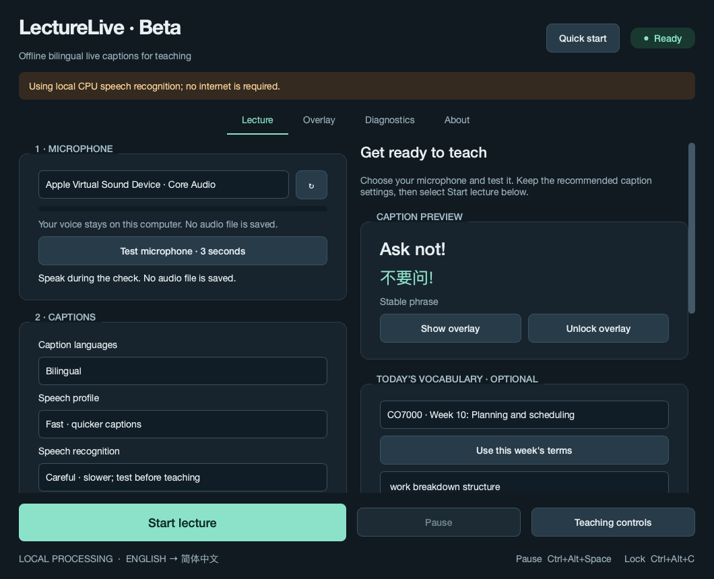

# Native macOS beta validation — 2026-09-21 UTC

Application version **0.5.0b1**, source commit **04b19622030c6848bb0552311dd060b20d89e6c8**.
[Successful native build and downloadable artifacts](https://github.com/DionCroft/Polyglot/actions/runs/35621470081).

## What ran

- GitHub-hosted Apple Silicon runner, `macOS-14.8.9-arm64-arm-64bit`. This is native ARM64 macOS execution, not a physical M2 MacBook Air classroom test.
- **83 tests passed** on macOS, including inherited-pipe timeout/EOF/oversized-frame faults, permission state handling, platform routing and recognition fallback. No failed or errored tests.
- The signed ARM64 `.app` passed real Base and Small speech decoding, Standard and Careful/vocabulary decoding, silence rejection, Chinese translation, VAD, all 12 CO7000 lists and the 92-term glossary.
- Fast Core ML executed encoder nodes (verified in ONNX Runtime profiling). Small Core ML reached its bounded compilation timeout; the same selected Small profile then worked on CPU. Automatic/Balanced uses CPU by design; Small Core ML remains explicit and experimental.
- Native Cocoa UI passed WAV-driven captions, preset round-trip, CO7000 selection, overlay click-through flags and minimum-window action visibility. Two global shortcuts registered without conflicts; delivery with another application focused still needs a physical test.
- PySide's **static** Darwin microphone permission plugin and native request handler were present. Permission status was read without prompting. This does not establish that a physical microphone or first-use permission dialog works on a colleague's Mac.
- PyInstaller built the native ARM64 bundle; deep/strict code-signature verification passed. The bundle contains a microphone usage description and declares macOS 14 as its minimum. ZIP and DMG are generated on macOS with native tools.

## Measured performance

The public JFK fixture is about 11 seconds of mono 16 kHz speech. These are single-run hosted-machine timings in seconds, not M2 benchmarks or an accent evaluation. Careful includes a short vocabulary prompt. Warm-up includes model loading, speech warm-up, translation and VAD setup. The source fixture is pinned in `fixtures.lock.json`.

| Profile / requested processor | Actual encoder | Warm-up | Standard | Careful |
|---|---|---:|---:|---:|
| fast / cpu | CPU | 3.47 | 1.10 | 2.00 |
| fast / coreml | Core ML | 42.38 | 3.54 | 2.73 |
| balanced / cpu | CPU | 7.01 | 2.66 | 3.71 |
| balanced / coreml | CPU | 188.33 | 3.29 | 4.21 |

Fast Core ML was slower than quantised CPU on this hosted machine. Core ML execution does not prove use of the GPU or Neural Engine: Apple chooses its internal compute device. Balanced CPU uses the larger quantised model and more time/memory; Careful adds decoding work. First Core ML compilation can take minutes, followed by a cached launch or CPU fallback.

The inference test process peaked at **3.02 GiB RSS**; the maximum child-process RSS was **2.37 GiB**. These independent process peaks need not coincide and are not a measured classroom memory total. The test loads multiple configurations sequentially, so these figures also do not represent a minimum RAM specification.

## Windows regression

Both Windows runtimes passed **81 tests**, with the two POSIX-pipe tests skipped appropriately. Both Windows editions rebuilt and passed their packaged speech, guided decoding, translation, VAD and CO7000 self-tests. Their GUI checks passed synthetic lecture captions, recognition preset persistence, course selection and action visibility. The Windows host was Snapdragon X Elite ARM64; the x64 beta ran under Windows emulation with DirectML, not on a physical Intel/AMD computer. Windows versions remain ARM64 0.3.2 and x64 beta 0.4.0b2.

## Remaining limits

There was no attached physical M2 Mac, teaching microphone/projector, lecturer recording set or Developer ID/notarisation credentials. Live capture, permission denial/recovery in System Settings, global shortcut delivery, full-screen presentation overlays, display changes, battery/thermal behaviour and M2 accent accuracy remain open. The normal app and accelerator worker enforce the Python offline guard and use bundled local models; native-library network activity has not been independently audited at OS level. A physical network-disconnected teaching check is still required.

This beta is ad-hoc signed and **not notarised**. Gatekeeper/quarantine installation on a colleague's managed Mac was not exercised by CI. Use the [installation guide](../MACOS.md) and [M2 acceptance checklist](../MACOS_PORT.md).

Raw records: [packaged inference](macos-0.5.0b1-packaged.json), [native UI](macos-0.5.0b1-ui.json), [test results](macos-0.5.0b1-pytest.xml), [Windows ARM64](windows-arm64-after-macos.json), [Windows x64](windows-x64-after-macos.json).

